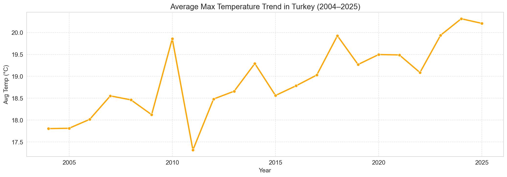
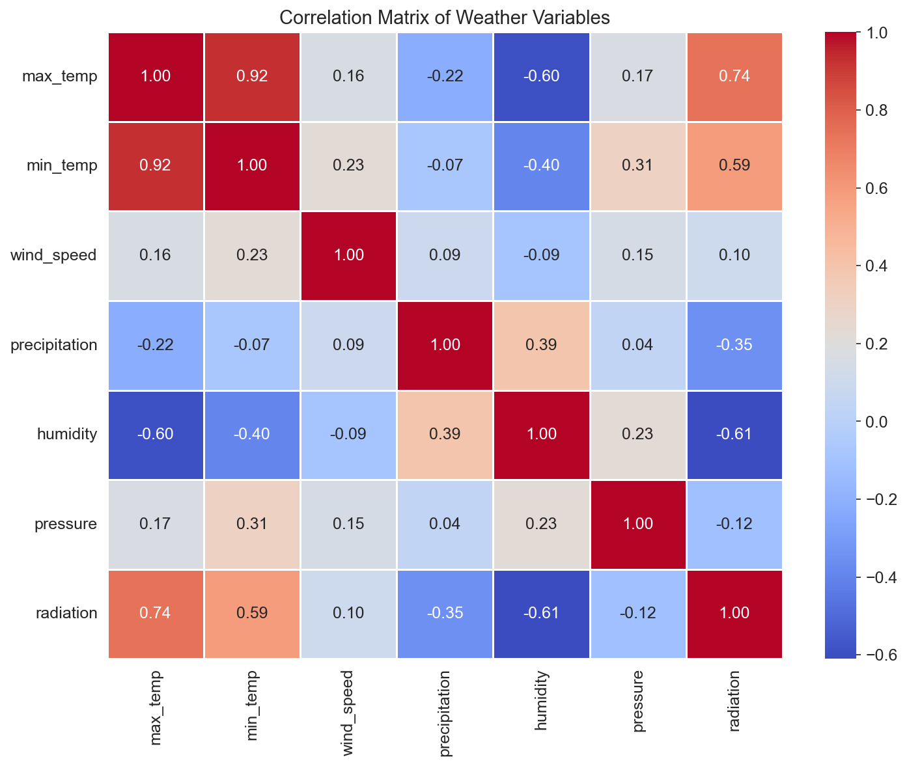
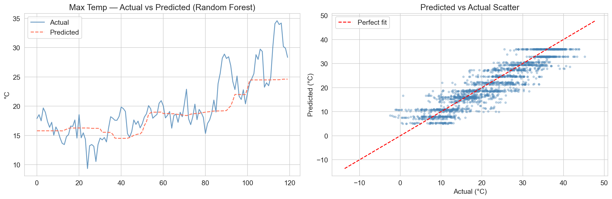
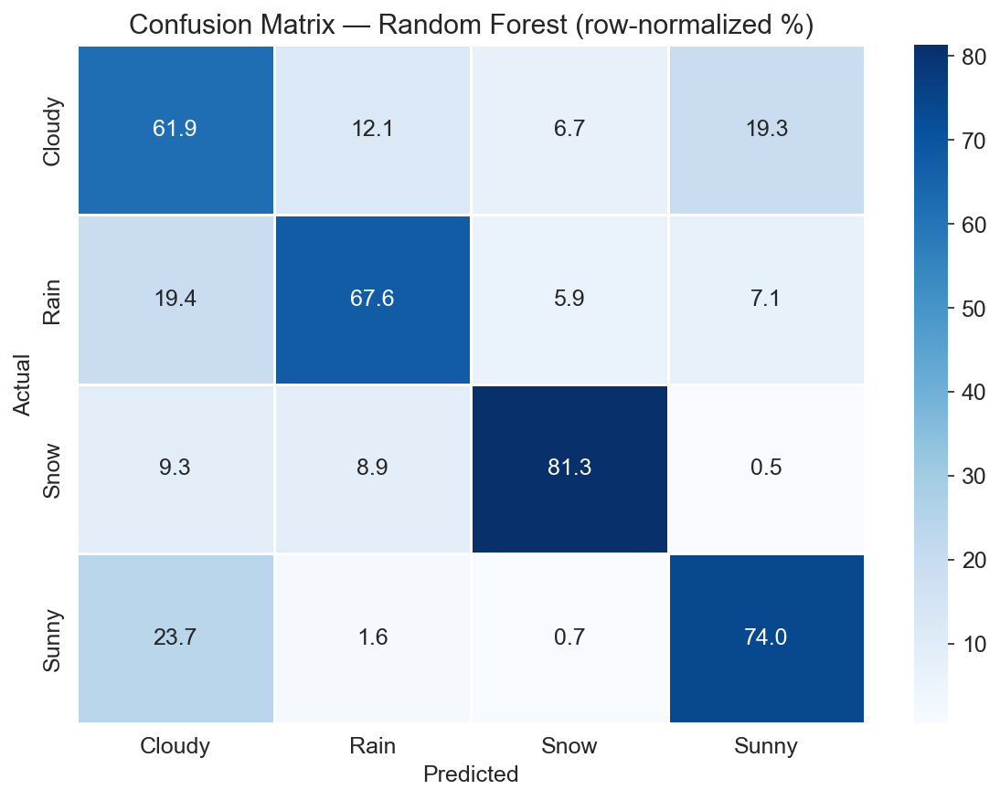

# 🌤️ Turkey AI Weather Forecast

<div align="center">


**Advanced Weather Prediction System powered by Ensemble Boosting AI**

A machine learning project that forecasts daily weather conditions and physical climate variables for all **81 cities in Turkey**, leveraging historical data from **2003 to 2025**.

</div>

---

## 📖 Project Overview

This project is a comprehensive **end-to-end Data Science & Machine Learning pipeline**.  
It processes over **20 years of meteorological data** across 81 Turkish cities to train and compare **5 ensemble models** in a two-stage prediction architecture.

### Two-Stage Prediction Pipeline

```
[City + Date]
     │
     ▼
┌─────────────────────────────┐
│   Stage 1: Regressor        │  Predicts 7 physical variables simultaneously:
│   Multi-Output Ensemble     │  max_temp, min_temp, precipitation,
│                             │  wind_speed, humidity, pressure, radiation
└────────────┬────────────────┘
             │  predicted features (precipitation excluded)
             ▼
┌─────────────────────────────┐
│   Stage 2: Classifier       │  Predicts weather condition:
│   Ensemble Classifier       │  ☀️ Sunny / ☁️ Cloudy / 🌧️ Rain / ❄️ Snow
└─────────────────────────────┘
```

> **Why exclude `precipitation` from the Classifier?**  
> Including it would be data leakage — knowing today's rainfall trivially predicts "Rain",  
> making the model useless for genuine future forecasting.

---

## 📡 Data Collection Architecture (ETL Pipeline)

To ensure data integrity and handle API rate limits, a **modular batch processing system** was designed.

- **Batch Scraping (Extraction):** Data collection split into 3 independent scripts (`data_collection/batch_xx.py`) using **Manual Sharding** — prevents data loss during network interruptions and respects API limits.
- **Data Merging (Transformation):** `merge_data.py` aggregates 81 raw city files, performs type casting, sorts temporally, and compiles the final `Turkey_Weather_Master.csv`.
- **Source:** Historical weather data (2003–2025) via the [Open-Meteo API](https://open-meteo.com/).

---

## 📊 Data Insights & Analysis (EDA)

In-depth exploratory data analysis was conducted on weather data from **2003 to 2025**.

### 1️⃣ Warming Trend in Turkey

Clear temperature trends and anomalies observed over two decades.



### 2️⃣ Humidity: Coastal vs. Inland Gap

One of the key modelling challenges — a ~32 percentage point humidity gap between coastal and inland cities.

| Region | Example City | Avg Humidity |
|--------|-------------|-------------|
| Karadeniz (Black Sea) | Rize | ~81% |
| Ege (Aegean) | İzmir | ~65% |
| İç Anadolu (Central) | Ankara | ~58% |
| Güneydoğu | Mardin | ~49% |

### 3️⃣ Feature Correlations

Correlation analysis across all meteorological variables.



---

## 🧠 Model Performance

Five algorithms were trained and compared. Train: **2003–2023** | Test: **2024–2025**.

### 🌡️ Stage 1: Multi-Output Regression (7 Targets)

| Model | Avg MAE | max_temp | min_temp | humidity | precipitation |
|-------|---------|----------|----------|----------|---------------|
| Random Forest | 4.078 | 3.43°C | 2.67°C | 9.88% | 2.41mm |
| LightGBM | 4.130 | 3.37°C | 2.56°C | 10.30% | 2.66mm |
| XGBoost | 4.140 | 3.32°C | 2.56°C | 10.40% | 2.65mm |
| Gradient Boosting | 4.139 | 3.33°C | 2.55°C | 10.36% | 2.64mm |
| CatBoost | 4.300 | 3.32°C | 2.58°C | 10.17% | 2.59mm |

> ⚠️ **Known limitation:** Humidity MAE ~10% reflects the large coastal/inland variance across Turkey's 81 cities. The lat/lon features partially capture this but a climatological mean feature would reduce this further.



---

### ☁️ Stage 2: Weather Condition Classification (4 Classes)

| Model | Accuracy | Rain F1 | Sunny F1 | Snow F1 | Cloudy F1 |
|-------|----------|---------|----------|---------|-----------|
| **Random Forest** | **68.62%** | 0.74 | 0.73 | 0.67 | 0.61 |
| LightGBM | 68.46% | 0.74 | 0.73 | 0.66 | 0.61 |
| Gradient Boosting | 68.37% | 0.73 | 0.73 | 0.66 | 0.61 |
| XGBoost | 67.36% | 0.73 | 0.72 | 0.64 | 0.60 |
| CatBoost | 66.93% | 0.72 | 0.72 | 0.64 | 0.58 |

**Design decisions:**
- `Partly Cloudy` class removed — only 8.3% of data, F1 score was ~0.17 across all models. Merged into `Sunny` (meteorologically defensible).
- `class_weight='balanced'` / `sample_weight` applied consistently across all models.
- Rain intensity (Light / Moderate / Heavy) derived from the regressor's `precipitation` output.



---

## 🌍 Geographic Feature Engineering

Turkey's 7 standard geographic regions were encoded as a feature to capture climate zone differences that lat/lon alone cannot express linearly:

```
Karadeniz · Marmara · Ege · Akdeniz · İç Anadolu · Doğu Anadolu · G.Doğu Anadolu
```

---

## 🚀 Features

- 🌍 **Nationwide Coverage** — all 81 provinces of Turkey
- 🔗 **Two-Stage Pipeline** — regressor feeds classifier, end-to-end
- 🧠 **5 Algorithms Compared** — RF, GBM, XGBoost, LightGBM, CatBoost
- 🌧️ **Rain Intensity** — Light / Moderate / Heavy via precipitation regressor
- 📍 **Geographic Awareness** — 7-region encoding + city coordinates
- 🖥️ **Interactive Dashboard** — built with Streamlit
- 📅 **Date-Based Forecasting** — dynamic prediction for any city × date

---

## 📂 Project Structure

```text
Turkey-Weather-Forecast/
│
├── assets/                        # Generated analysis plots
│   ├── temp_trend_2003_2025.png
│   ├── correlation_matrix.png
│   ├── regression_actual_vs_pred.png
│   └── confusion_matrix.png
│
├── data/                          # Data storage
│   ├── Turkey_Weather_Master.csv  # Final merged dataset
│   ├── locations.csv              # City coordinates + plate codes
│   └── city_weather_data/         # Raw CSV shards (81 files)
│
├── data_collection/               # ETL pipeline
│   ├── batch_01.py                # Cities 0–27
│   ├── batch_02.py                # Cities 27–54
│   ├── batch_03.py                # Cities 54–81
│   └── merge_data.py              # Aggregation script
│
├── models/                        # Saved model packages (.pkl)
│   ├── temperature_models.pkl     # Regression models + metadata
│   └── weather_classifiers.pkl    # Classification models + metadata
│
├── notebooks/
│   └── Turkey_Weather_Analysis.ipynb
│
├── app.py                         # Streamlit dashboard
├── train_regressor.py             # Multi-output regression training
├── train_classifier.py            # Classification training
├── requirements.txt               # Dependencies
└── README.md
```

---

## 🛠️ Installation & Usage

### 1️⃣ Clone the Repository

```bash
git clone https://github.com/miraccelikel/Turkey-Weather-Forecast.git
cd Turkey-Weather-Forecast
```

### 2️⃣ Install Dependencies

```bash
pip install -r requirements.txt
```

### 3️⃣ Data Collection *(Optional — dataset already included)*

```bash
cd data_collection
python batch_01.py   # Fetches cities 0–27
python batch_02.py   # Fetches cities 27–54
python batch_03.py   # Fetches cities 54–81
python merge_data.py # Merges all shards into Master CSV
cd ..
```

### 4️⃣ Train the Models

```bash
python train_regressor.py    # Stage 1 — Multi-output regression
python train_classifier.py   # Stage 2 — Weather classification
```

### 5️⃣ Run the Application

```bash
streamlit run app.py
```

---

## ⚠️ Known Limitations

| Issue | Cause | Potential Fix |
|-------|-------|---------------|
| Humidity MAE ~10% | Large coastal/inland variance | Add climatological mean per city × month |
| Cloudy F1 ~0.61 | Rain↔Cloudy boundary is physically ambiguous | Structural limit, hard to improve |
| Precipitation MAE ~2.4mm | Zero-inflated, skewed distribution | Two-stage model (classifier + regressor) |

---

## 👤 Author

**Miraç Çelikel**  
Software Engineering Student  
Adana Alparslan Türkeş Science and Technology University (ATU)  

